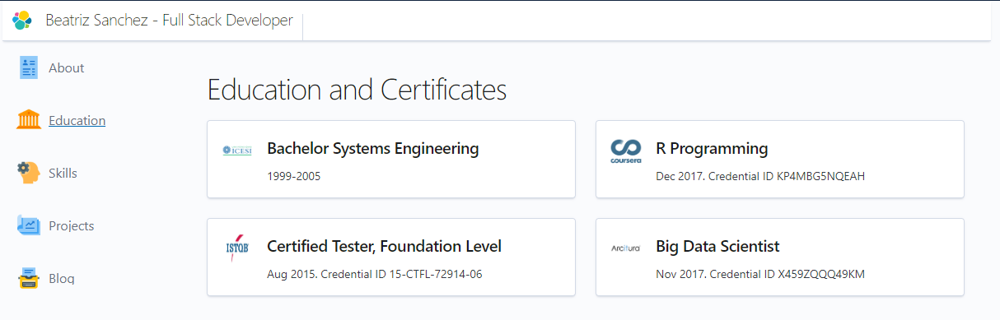

# Welcome to my Portfolio

This project was made using [React](https://reactjs.org/) and [Elastic UI](https://elastic.github.io/) as a learning practice.

The latest version is deployed [here](https://beatrizsanchez.dev).



## Setup

To run this project using npm:

```
$ npm install
$ npm start
```

## Features

- **About**: A short description about myself.
- **Education**: Cards were used to display diplomas and certifications.
- **Skills**: A table with sorting option by column header, shows my skilss and levels. Hooks were used here.
- **Projects**: A card displays information about this project, and a link to this repository.
- **Blog**: Here I used different text components for displaying a short article that I wrote.

## Sources

I took inspiration from [this portfolio](https://andrewborstein.com/).

## Future features

- Unit Testing with Jest.
- I want to change the Project section and fetch my projects from Github.
